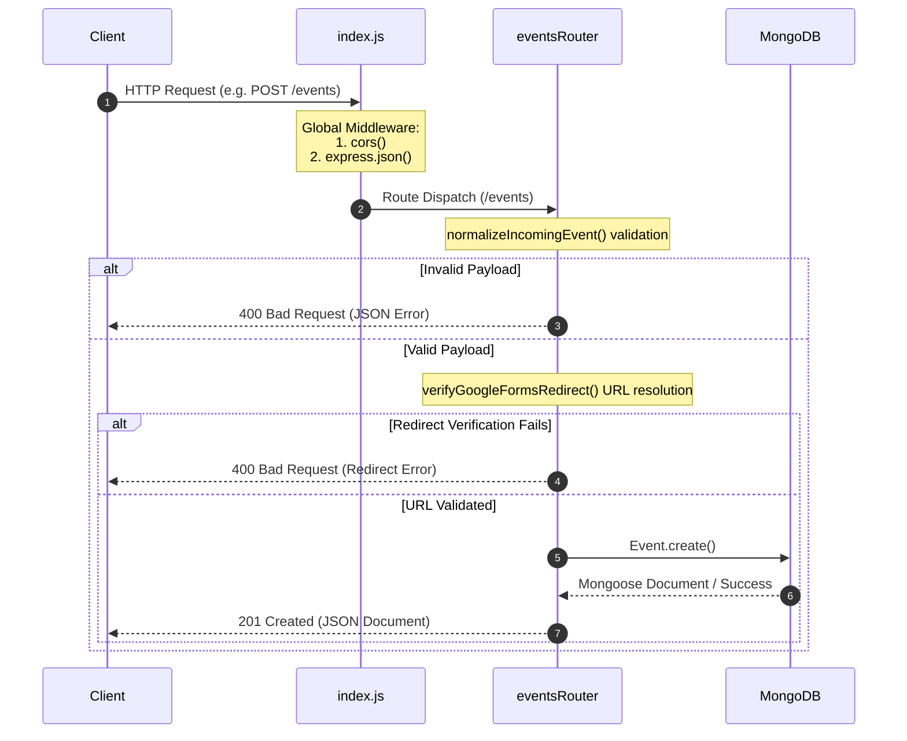
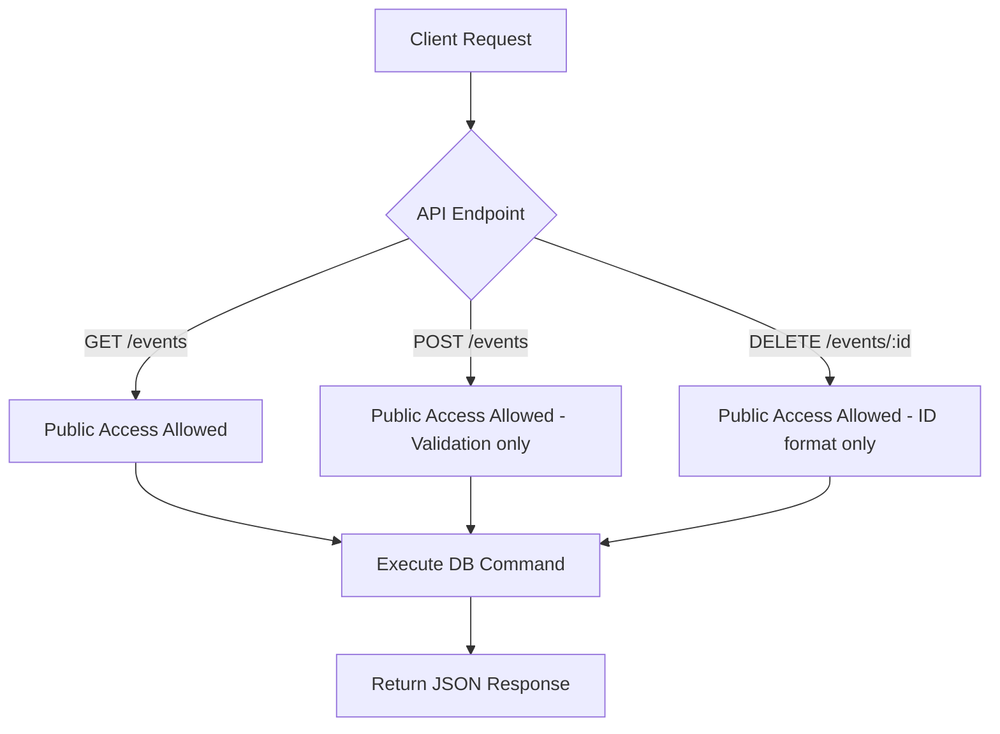
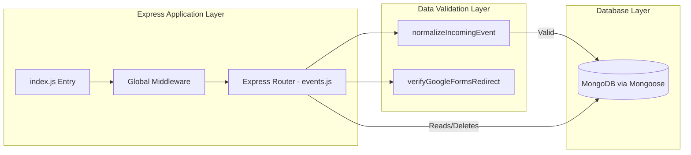

# Backend Architecture Report

This document provides a comprehensive technical overview of the backend codebase for the college events platform, serving as an architecture review and onboarding guide for engineers.

---

## 1. Project Overview

*   **Backend Framework & Version:** Express.js (v5.2.1)
*   **Language:** JavaScript (Node.js CommonJS style)
*   **Runtime:** Node.js
*   **Package Manager:** npm (utilizing `package.json` and `package-lock.json`)
*   **Architecture Pattern:** Layered / MVC-lite pattern. The codebase separates database schemas ([models/](file:///c:/Users/ramit/Resume_projects/refine/fullstack-web/backend/models)) from route handling and request processing ([routes/](file:///c:/Users/ramit/Resume_projects/refine/fullstack-web/backend/routes)). Handlers act directly as controllers within the route files.

---

## 2. Folder Structure

The backend application is compact and structured as follows:

```
backend/
├── .env.example            # Environment configuration template
├── index.js                # Server entry point, DB connection, global middleware
├── package.json            # Project dependencies and script declarations
├── package-lock.json       # Strict tree lockfile for project dependencies
├── models/
│   └── Event.js            # Mongoose Schema/Model definition for Events
└── routes/
    └── events.js           # API route controllers and request validation logic
```

### File and Directory Descriptions:
*   [index.js](file:///c:/Users/ramit/Resume_projects/refine/fullstack-web/backend/index.js): Coordinates environment loading, configures CORS and JSON parsing, establishes database connections through Mongoose, and boots up the HTTP server listener.
*   [models/Event.js](file:///c:/Users/ramit/Resume_projects/refine/fullstack-web/backend/models/Event.js): Defines Mongoose ODM rules, types, defaults, and enums for Event documents.
*   [routes/events.js](file:///c:/Users/ramit/Resume_projects/refine/fullstack-web/backend/routes/events.js): Declares HTTP mapping for events collection and contains core verification logic (payload filters, Google Forms redirect tests).

---

## 3. Request Lifecycle

The flow of an HTTP request through the backend codebase:



### Detailed Lifecycle Phases:
1.  **Entry Point:** The request arrives at the port listener in `index.js`.
2.  **Middleware Execution:** Passes through global middleware (`cors()` for headers and `express.json()` for parsing the body).
3.  **Routing:** Delegated to `routes/events.js` via the `/events` prefix mount.
4.  **Controllers (Inline):** The route handlers act as controllers. For writes (`POST`), the helper `normalizeIncomingEvent` verifies types, required strings, and category tags.
5.  **Redirect Verification:** If links are submitted, the server resolves redirects through outgoing `fetch()` calls to confirm host ownership (`forms.gle` or `docs.google.com`).
6.  **Database ODM:** Reads and writes are executed via Mongoose queries (`Event.find` or `Event.create`).
7.  **Response:** Success status codes (`200 OK`, `201 Created`) or error payloads (`400 Bad Request`, `404 Not Found`, `500 Server Error`) are returned to the client as JSON.

---

## 4. API Routes

The backend exposes the following API routes:

| Method | Endpoint | Controller / Handler (Location) | Middleware | Purpose |
| :--- | :--- | :--- | :--- | :--- |
| **GET** | `/` | Root inline handler ([index.js:31](file:///c:/Users/ramit/Resume_projects/refine/fullstack-web/backend/index.js#L31)) | None | Service index displaying available API routes. |
| **GET** | `/health` | Health inline handler ([index.js:43](file:///c:/Users/ramit/Resume_projects/refine/fullstack-web/backend/index.js#L43)) | None | Health check status verification. |
| **GET** | `/events` | Get events router ([events.js:96](file:///c:/Users/ramit/Resume_projects/refine/fullstack-web/backend/routes/events.js#L96)) | None | Fetch events, supporting dynamic `category` filtering. |
| **POST** | `/events` | Add event router ([events.js:114](file:///c:/Users/ramit/Resume_projects/refine/fullstack-web/backend/routes/events.js#L114)) | None | Validate, verify form links, and insert a new Event record. |
| **DELETE** | `/events/:id` | Delete event router ([events.js:147](file:///c:/Users/ramit/Resume_projects/refine/fullstack-web/backend/routes/events.js#L147)) | None | Delete an event from the database by its unique ObjectId. |

---

## 5. Controllers

All logic handling requests is embedded within the routing handlers in [routes/events.js](file:///c:/Users/ramit/Resume_projects/refine/fullstack-web/backend/routes/events.js).

### Controller Functions:
*   **Events Fetch (`GET /events`):**
    *   *Responsibilities:* Extracts optional query parameter `category`, validates the enum values, constructs query criteria, and returns sorted events.
    *   *Dependencies:* `Mongoose.Model (Event)`.
*   **Events Create (`POST /events`):**
    *   *Responsibilities:* Runs payload normalization, triggers Google Forms redirect checkers, and inserts entries.
    *   *Dependencies:* `Mongoose.Model (Event)`, URL checks, global `fetch()`.
*   **Events Delete (`DELETE /events/:id`):**
    *   *Responsibilities:* Reads the `id` path parameter, deletes the matching record, and handles invalid ID syntax.
    *   *Dependencies:* `Mongoose.Model (Event)`.

---

## 6. Services / Business Logic

The backend does not implement a separate business logic layer. The primary business rules are contained in helper methods in [routes/events.js](file:///c:/Users/ramit/Resume_projects/refine/fullstack-web/backend/routes/events.js):

*   **`normalizeIncomingEvent(body)`:** Validates and normalizes incoming data.
    *   Ensures `type` matches `["volunteer", "register", "both"]`.
    *   Verifies `category` is one of `["upcoming", "past", "marquee"]`.
    *   *Constraint Rule:* Blocks writes with category `"past"` to preserve the exhibition-only nature of completed events.
    *   Confirms presence of corresponding links depending on the chosen `type`.
*   **`verifyGoogleFormsRedirect(urlString)`:** Resolves redirect domains.
    *   Ensures links are pointing to valid Google Forms domains (`forms.gle` or `docs.google.com/forms`).
    *   Applies a 6-second timeout limit using `AbortController` to prevent hanging requests.

---

## 7. Database

*   **Database Type:** MongoDB
*   **ODM:** Mongoose (v9.3.3)
*   **Models:** `Event` (mapped to `events` collection)

### Mongoose Schema Details ([models/Event.js](file:///c:/Users/ramit/Resume_projects/refine/fullstack-web/backend/models/Event.js)):

| Field Name | Data Type | Constraints & Validations | Default Value | Description |
| :--- | :--- | :--- | :--- | :--- |
| `_id` | ObjectId | MongoDB Auto-generated | - | Unique record identifier. |
| `title` | String | Required, Trimmed | - | Name/Title of the event. |
| `description`| String | Trimmed | `""` | Details/Agenda summary. |
| `club` | String | Trimmed | `""` | Organizing club. |
| `type` | String | Enum: `["volunteer", "register", "both"]`, Required | - | Event type. |
| `category` | String | Enum: `["upcoming", "past", "marquee"]` | `"upcoming"` | Scheduling state. |
| `volunteerLink`| String | Trimmed | `""` | Link to volunteer registration. |
| `registerLink` | String | Trimmed | `""` | Link to attendee registration. |
| `createdAt` | Date | - | `Date.now` | Registration timestamp. Used for sorting. |

*   **Relationships:** None (No reference keys or foreign relations are set).
*   **Indexes:** Default `_id` index. No custom indexes are defined.
*   **Migrations:** No migration files or schema management directories exist.

---

## 8. Authentication & Authorization

> [!WARNING]
> **Authentication & Authorization Status:** **Not found in codebase.**
> The backend lacks user models, passwords, registration routes, login sessions, JWT token generation, role guards, or permission rules. All API routes (including writes and deletions) are completely public and accessible.

---

## 9. Middleware

### Registered Middleware:

| Execution Order | Middleware Name | Origin | Scope | Purpose | Registered in |
| :---: | :--- | :--- | :--- | :--- | :--- |
| 1 | `cors()` | `cors` package | Global | Inject CORS headers to allow cross-origin requests. | `index.js:27` |
| 2 | `express.json()` | Express core | Global | Parse incoming HTTP bodies containing JSON payloads. | `index.js:28` |

No custom middlewares are registered.

---

## 10. Environment Variables

Environment variables are loaded on server startup inside [index.js](file:///c:/Users/ramit/Resume_projects/refine/fullstack-web/backend/index.js#L9-L23) via `dotenv`.

| Variable Name | Purpose | Required / Optional | Default Value |
| :--- | :--- | :---: | :--- |
| `MONGODB_URI` | MongoDB Atlas cluster connection string. | **Required** | None (crashes server if missing) |
| `PORT` | Local network port the server listens on. | Optional | `5000` |

---

## 11. External Services

No direct integrations with third-party payment gateways, OAuth services, email delivery agents, or media cloud buckets exist.

*   **Outgoing URL Verification:** The backend makes outgoing GET calls using Node's global `fetch` API inside [routes/events.js:24](file:///c:/Users/ramit/Resume_projects/refine/fullstack-web/backend/routes/events.js#L24) to verify that target links redirect to valid Google Forms hosts.

---

## 12. Utilities

*   **`loadEnvFromFile()` ([index.js:9](file:///c:/Users/ramit/Resume_projects/refine/fullstack-web/backend/index.js#L9)):** Manually reads and parses the `.env` file, resolving UTF-8 BOM encoding markers (`\uFEFF`) that can cause key parsing bugs.
*   **`isGoogleFormsUrl(urlString)` ([routes/events.js:6](file:///c:/Users/ramit/Resume_projects/refine/fullstack-web/backend/routes/events.js#L6)):** Validates URL strings to confirm their hostnames are either `forms.gle` or `docs.google.com`.

---

## 13. Error Handling

*   **Global Error Middleware:** **Not found in codebase.** No default error capture function (`app.use((err, req, res, next) => ...`) is present.
*   **Controller Level Try-Catch:** Route endpoints are wrapped in `try/catch` handlers.
    *   Validation issues (e.g. duplicate keys or malformed structures) yield a `400 Bad Request` containing `{ message: "..." }`.
    *   Uncaught system exceptions return a `500 Internal Server Error` with `{ message: "Failed to fetch events." }` or similar.
    *   Missing records during deletion yield a `404 Not Found` with `{ message: "Event not found." }`.

---

## 14. Logging

*   **Logging Strategy:** Minimal console logs (`console.log`, `console.error`) on server lifecycle milestones (e.g. database connection success/failure, listening port start).
*   **Request Logging:** No logger middleware (such as `morgan` or `winston`) is configured to record incoming requests.

---

## 15. Security

*   **CORS:** Enabled globally, allowing all origins.
*   **Helmet:** Not found in codebase. No HTTP header security protections are configured.
*   **Rate Limiting:** Not found in codebase. No protections against DDoS or brute-force requests are active.
*   **Password Hashing:** Not found (no user data is managed).
*   **Input Sanitization:** String properties are trimmed, and `isGoogleFormsUrl` filters outgoing links, but no explicit sanitization library (like `dompurify` or validator middleware) is integrated.
*   **Major Security Concerns:**
    *   *Lack of Route Guards:* `POST /events` and `DELETE /events/:id` are completely unprotected. Anyone can create or delete events using clients like curl or Postman.

---

## 16. Configuration

*   **Environment Config:** Configured via a `.env` file at the root of the backend folder.
*   **Mongoose Connection Config ([index.js:61](file:///c:/Users/ramit/Resume_projects/refine/fullstack-web/backend/index.js#L61)):**
    *   `serverSelectionTimeoutMS`: `10000` (10 seconds timeout for DB discovery)
    *   `family`: `4` (force IPv4 to bypass local DNS resolution delays)
    *   `tlsAllowInvalidCertificates`: `true` (simplifies SSL handshakes on environments like Render)

---

## 17. Dependencies

Excerpts from [package.json dependencies](file:///c:/Users/ramit/Resume_projects/refine/fullstack-web/backend/package.json#L12-L19):

*   **`express` (^5.2.1):** Standard framework routing and HTTP request mapping.
*   **`cors` (^2.8.6):** Handles cross-origin requests.
*   **`mongoose` (^9.3.3):** ODM mapping MongoDB queries to schemas.
*   **`dotenv` (^17.3.1):** Loads configurations from `.env` files.
*   **`mongodb` (^7.1.1):** Direct MongoDB driver (transitive dependency of Mongoose).
*   **`mongodb-memory-server` (^11.0.1):** Local in-memory DB utility. *Note: declared in dependencies but never imported or utilized in index.js.*

---

## 18. Code Flow Diagram

### Authentication Flow (Current State)



### Overall Architecture Layering



---

## 19. Current Backend Strengths

1.  **Lightweight:** Minimal architecture footprint with very fast startup time.
2.  **Reliable Configuration Loading:** The custom environmental variable loader resolves common UTF-8 BOM encoding syntax errors.
3.  **Active Verification:** The URL resolver validation protects against dead/fake link entries by checking if Google Forms redirects are valid in real-time.
4.  **Optimized Mongoose settings:** Forcing IPv4 (`family: 4`) and allowing TLS invalid certs prevents slow network handshakes in cloud staging environments.

---

## 20. Technical Debt

1.  **Unprotected Mutating Endpoints:** There is no authentication checking on write (`POST`) or delete (`DELETE`) operations.
2.  **No Layer Separation (Service/Controller):** Validation helpers and DB handlers are written directly within the Express router [routes/events.js](file:///c:/Users/ramit/Resume_projects/refine/fullstack-web/backend/routes/events.js), which can complicate testing and refactoring.
3.  **Unused Dependencies:** `mongodb-memory-server` is installed but never imported or executed, inflating dependency build sizes.
4.  **No Global Exception Catching:** Unhandled promise rejections inside custom middlewares or helpers could terminate the node server process.
5.  **No Audit Logging:** Lacks basic request logging (e.g. `morgan`) to track client calls.

---

## 21. Improvement Recommendations

### High Priority:
1.  **Introduce API Authentication:** Secure `POST` and `DELETE` endpoints using a secret header key check (e.g., matching a `CLUB_HEAD_API_KEY` defined in environment variables) or a basic JWT auth middleware.
2.  **Add Global Error Handler:** Register a fallback error middleware in `index.js` to catch exceptions and prevent server crashes.

### Medium Priority:
1.  **Extract Handler Controllers:** Refactor `routes/events.js` to move validation, verification, and database commands into a separate controller layer.
2.  **Configure Express Logger:** Integrate request loggers (e.g., `morgan`) to capture request audits.
3.  **Configure Security Headers:** Install and register `helmet` to inject headers (XSS protections, frameguard, etc.).

### Low Priority:
1.  **Clean Dependencies:** Remove unused `mongodb-memory-server` from dependencies in `package.json`.
2.  **Enforce Custom Indexes:** Define Mongoose indexes on frequently read fields (like `category`) for database optimization.

---

## 22. Appendix

### Complete Folder Tree:
```
backend/
├── .env.example
├── index.js
├── package-lock.json
├── package.json
├── models/
│   └── Event.js
└── routes/
    └── events.js
```

### Complete Configuration Template (`.env.example`):
```ini
MONGODB_URI=mongodb+srv://<username>:<password>@<cluster-url>/<database>?retryWrites=true&w=majority
PORT=5000
```

### Server Execution Commands:
*   **Install dependencies:** `npm install`
*   **Run server in development:** `node index.js` (No nodemon configured)
